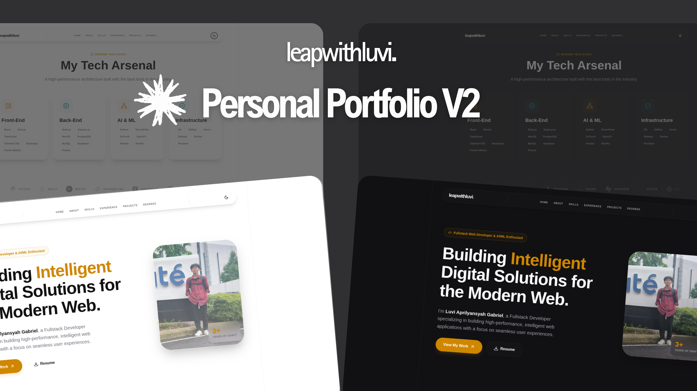

# 🌟 Luvi Aprilyansyah Gabriel — Personal Portfolio V2 (Next.js)

<!-- GitHub badges -->
[](https://github.com/leapwithluvi/portfolio-next/stargazers)
[](https://github.com/leapwithluvi/portfolio-next/forks)
[](https://github.com/leapwithluvi/portfolio-next/commits)
[](https://github.com/leapwithluvi/portfolio-next/pulls)



[](https://github.com/leapwithluvi)
[](https://github.com/leapwithluvi/portfolio-next/blob/main/LICENSE)
[](https://www.typescriptlang.org/)


## 🖥️ Live Preview

👉 **[Visit My Live Portfolio → luvi.my.id](https://luvi.my.id)**

## 🚀 One-Click Deploy

If you like this template, feel free to deploy your own version for **FREE**!

[](https://vercel.com/new/clone?repository-url=https%3A%2F%2Fgithub.com%2Fleapwithluvi%2Fportfolio-next)

*Don't forget to give a ⭐ if you use this!*

<details><summary>📸 Project Screenshots</summary>


*(Screenshots are updated periodically as the design evolves)*

</details>

## 📖 Table of Contents

<details><summary>Table of Contents</summary>

- [Description](#-description)
- [Key Features](#-key-features)
- [Folder Structure](#-folder-structure)
- [Technologies Used](#-technologies-used)
- [Get Started](#-get-started)
- [Customization Guide](#-customization-guide)
- [Featured Projects](#-featured-projects)
- [Contact](#-contact)
- [Credits](#-credits--inspiration)
- [License](#-license)

</details>

## 📝 Description

**Luvi Aprilyansyah Gabriel — Personal Portfolio V2** is the evolution of my technical showcase, rebuilt from the ground up using **Next.js 15**, **React 19**, and **Tailwind CSS**. It serves as a modern, high-performance portal for my work as a **Fullstack Developer & AI/ML Enthusiast**.

Designed with a "Data-First" philosophy, this template separates logic from content, allowing for rapid updates and seamless project management while maintaining a premium, enterprise-grade aesthetic with advanced glassmorphism and fluid animations.

## ✨ Key Features

- **🎨 Premium UI/UX**: Elegant dark/light mode with advanced glassmorphism and consistent spacing.
- **🚀 Next-Gen Performance**: Built on Next.js 15 for lightning-fast Page Speed and SEO indexing.
- **🔍 SEO Ready**: Pre-configured JSON-LD structured data and comprehensive metadata for search engines.
- **🦾 Data-Driven Architecture**: Manage all site content (Profile, Skills, Projects) through single TypeScript data files.
- **💫 Fluid Interactions**: Smooth micro-animations and section transitions powered by **Framer Motion**.
- **⚡ Enterprise Footer**: Professional multi-column footer with live status badges and global presence info.

## 🌟 Why Choose This Template?

- **Zero Config**: Just edit the data files and you're good to go.
- **Top-Tier Performance**: Pre-optimized images and scripts for 100/100 Lighthouse score.
- **Clean Architecture**: Built by a developer for developers.
- **Modern Stack**: Using the bleeding edge of Next.js and React technology.

## 📂 Folder Structure

<details><summary><b>Project Layout</b></summary>

```bash
src/
├── app/            # Next.js App Router (Layouts, Pages, Metadata)
├── components/     
│   ├── ui/         # Reusable atomic UI components (Buttons, Grid Patterns)
│   └── sections/   # Major page blocks (Hero, About, Projects, etc.)
├── data/           # 💡 THE BRAIN (Edit your profile, skills, and projects here)
├── lib/            # Shared utility functions and library configs
├── types/          # Global TypeScript interfaces
└── layout.tsx      # Main application entry point
```

</details>

## ✨ Technologies Used

<details><summary>Built with a cutting-edge high-performance stack:</summary>

- [Next.js 15](https://nextjs.org/): The industry standard for production React apps.
- [React 19](https://react.dev/): The latest UI library features.
- [TypeScript](https://www.typescriptlang.org/): For strict, error-free engineering.
- [Tailwind CSS 4](https://tailwindcss.com/): Rapid styling with modern utility classes.
- [Framer Motion](https://www.framer.com/motion/): Premium animation engine.
- [Lucide React](https://lucide.dev/): Simple, professional vector icons.

</details><br/>

[](https://skillicons.dev)

## 🧰 Get Started

```bash
# Clone the repository
git clone https://github.com/leapwithluvi/portfolio-next.git

# Install dependencies
npm install

# Run development server
npm run dev
```

## ⚙️ Customization Guide

Personalize this portfolio in minutes by editing the files in `src/data/`:

| File | Content |
| :--- | :--- |
| `profile.ts` | Name, Bio, and **Preloader Greetings** sequence. |
| `seo.ts` | **Search Engine Optimization**, OG Tags, and **Favicon**. |
| `experience.ts`| Work history and **Sticky-Scroll Statistics**. |
| `navigation.ts`| Unified control for Navbar and Footer links. |
| `projects.ts` | Showcase projects with images and tags. |
| `socials.ts` | Social media URLs and official brand icons. |
| `techstack.ts` | Detailed breakdown of technical skills. |
| `footer.ts` | Footer tagline and operational status text. |

## 🚀 Featured Projects

- 🔗 [Portfolio V1 (Vite + React) - Personal Website](https://github.com/leapwithluvi/portfolio)
- 🔗 [Portfolio V2 (Next.js + React) - Personal Website](https://github.com/leapwithluvi/portfolio-next)
- 🔗 [Library Management System](https://github.com/leapwithluvi/library-management-system)
- 🔗 [Conversational AI Platform](https://github.com/leapwithluvi/ai-chatbot)
- 🔗 [Express TypeScript Starter](https://github.com/leapwithluvi/express-typescript-starter)

---

## 📬 Contact

| Platform | Link |
| :--- | :--- |
| 📧 Email | [itsluvi13@gmail.com](mailto:itsluvi13@gmail.com) |
| 💼 LinkedIn | [luviaprilyansyahgabriel](https://www.linkedin.com/in/luviaprilyansyahgabriel) |
| 🐙 GitHub | [leapwithluvi](https://github.com/leapwithluvi) |
| 📸 Instagram | [@byl.rooks](https://www.instagram.com/byl.rooks) |

---

## 📋 License

This project is licensed under the **MIT License** See the [LICENSE](LICENSE) file for more details.

---

## 🚀 Let's Connect

I'm currently open to **Junior Developer opportunities**, freelance projects, and AI/ML collaborations. If you're looking for a passionate Fullstack Developer who loves building scalable and beautiful products, let's talk!

> Built with by **Luvi Aprilyansyah Gabriel** — Fullstack Web Developer & AI/ML Enthusiast
